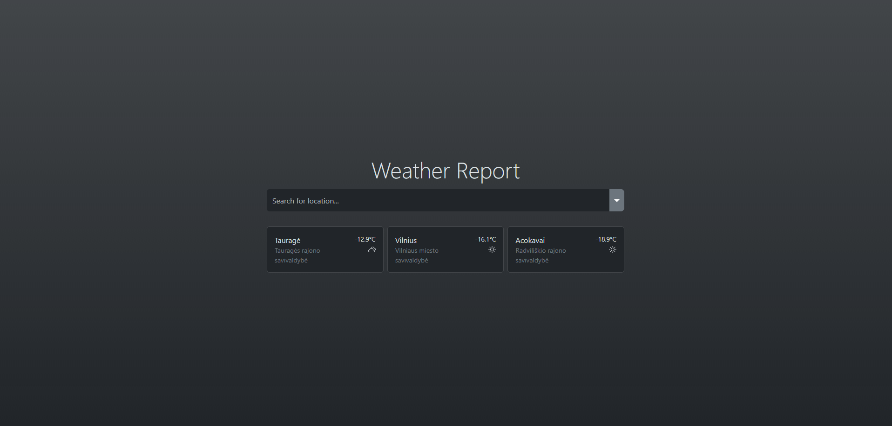
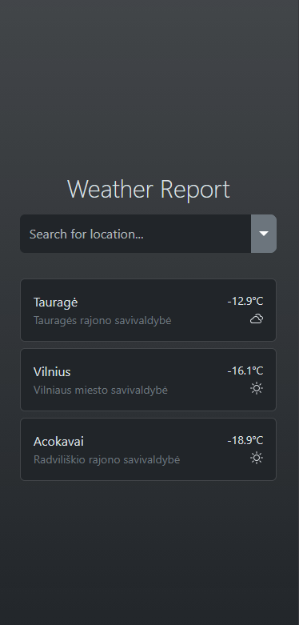
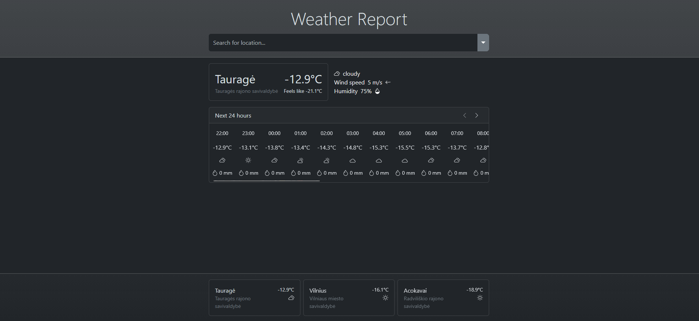
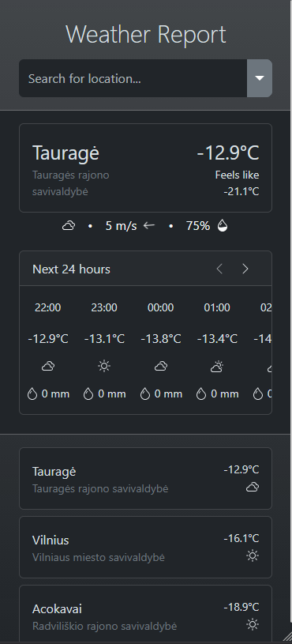
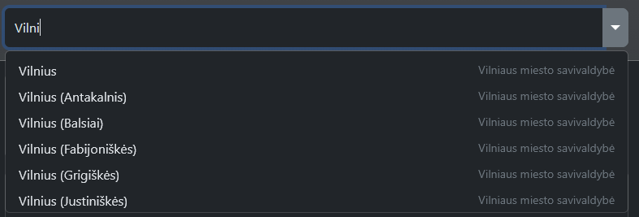
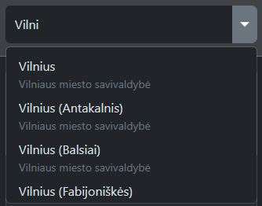
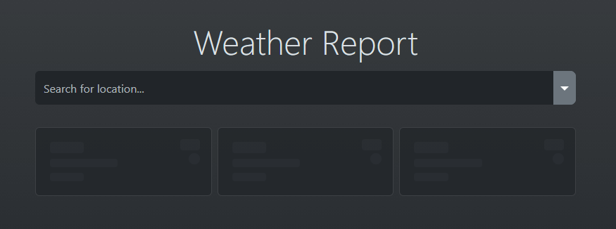
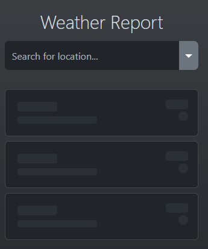

# Weather Report

Website URL: https://weather-report-ten.vercel.app/

## About
Web app designed to designed to get simply and quickly get weather information in Lithuania and surounding territories.

Data taken from public https://api.meteo.lt/.

## Usage

Opening forecast:
- Location is searchable via input / dropdown field and filtered by location name.
- Most viewed locations are available via quick access cards at the bottom of the screen.

Forecast information:
- Top part of the forecast displays current weather conditions (current temperature, feels like temperature, wind speed, wind direction, humidity).
- Table bellow displays hourly weather information.
  - Different forecast days can be navigated via arrows at the top right corner of the table.
  - Every table column displays in order: forecast time, temperature, condition, participation amount.

## Design

| Desktop view | Mobile view |
|-|-|
|||
|||
|||
|||

## Technical documentation

- [Weather Report Backend](./weather-report-backend/README.md)
- [Weather Report Frontend](./weather-report-frontend/README.md)